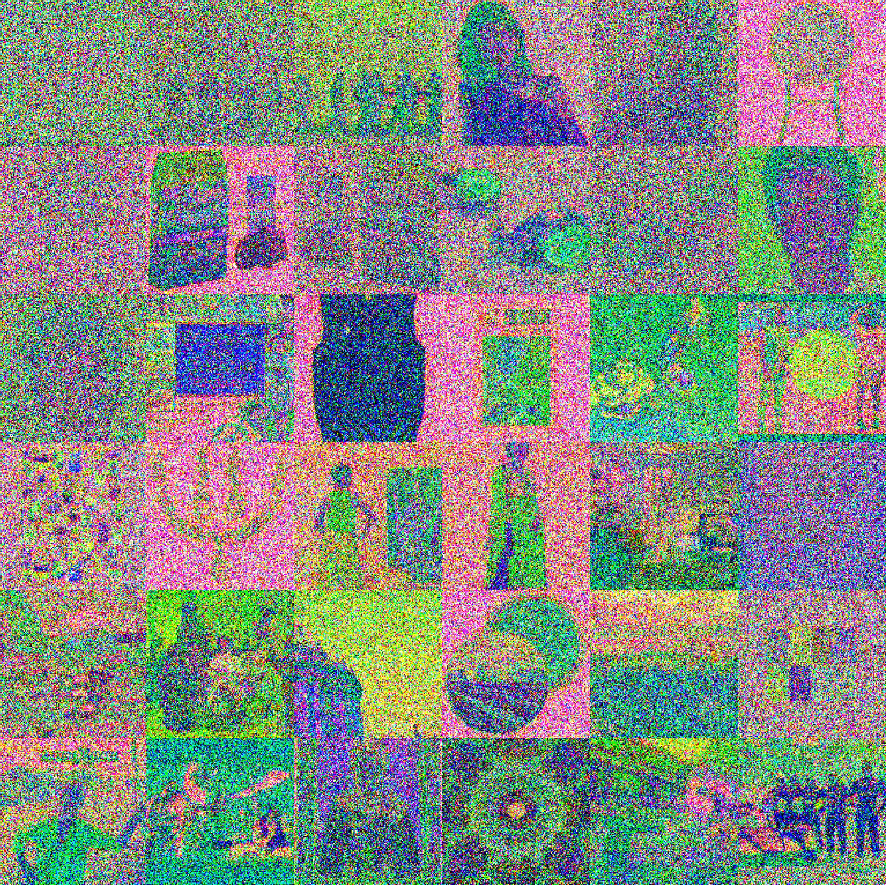

## Consistent Diffusion Meets Tweedie: Training Exact Ambient Diffusion Models with Noisy Data

This repository hosts the official PyTorch implementation of the paper: [Consistent Diffusion Meets Tweedie: Training Exact Ambient Diffusion Models with Noisy Data](https://giannisdaras.github.io/publications/consistent_diffusion_meets_tweedie.pdf).


Authored by: Giannis Daras, Alexandros G. Dimakis, Constantinos Daskalakis

**TLDR**: You can use this repo to finetune state-of-the-art diffusion models (SDXL) with data that is corrupted by additive Gaussian noise. This can be used as a measure to **reduce memorization** of the training set or can be used in applications where the data is inherently noisy.


To train with linearly corrupted data, see Ambient Diffusion ([\[code\]](https://github.com/giannisdaras/ambient-diffusion), [\[paper\]](https://arxiv.org/abs/2305.19256)).


### Example Training Data


### Generated images


## Installation

The recommended way to run the code is with an Anaconda/Miniconda environment.
First, clone the repository: 
```
git clone https://github.com/giannisdaras/ambient-tweedie.git
```

Then, create a new Anaconda environment and install the dependencies:

`conda env create -f environment.yaml -n ambient_tweedie`

The next step is to set some environmental variables. For your convenience, you can run the following command:

```bash
source .env
```
Remember to update the `.env` file with the correct paths.


[Not Recommended]: **Installation using pip**: If you have already an environment setup and you only want to install the project specific dependencies, you can do so by running the following command:

```bash
pip install gdown invisible_watermark transformers accelerate safetensors datasets peft wandb imageio s3fs seaborn plotly opencv-python==4.8.0.74 webdataset git+https://github.com/giannisdaras/ambient_utils.git git+https://github.com/huggingface/diffusers.git 
```


### Download datasets

The experiments in the paper used a subset of the LAION-10k dataset and the FFHQ dataset. You can download all the datasets by running the following script:

```bash
source util_scrips/download_datasets.sh
```
This command will take a few minutes to complete.

Alternatively, you can skip this step and use your own datasets or datasets from `datasets`.

## Identifying memorized examples

In this section, we use a pre-trained Stable Diffusion XL to identify memorized examples from LAION-10k. The dataset of SDXL is not known, but in the paper we show strong evidence that the SDXL model has seen images from LAION.

Our attack works by severy corrupting images from LAION and then using the SDXL model to restore them. If the model is able to perfectly restore images under severe corruption, then it is likely that the model has seen the images during training.

We consider two types of corruption: additive Gaussian noise and masking. To launch the additive Gaussian noise attack, run the following command:

```bash
python attack_scripts/attack_with_noise.py --whole_pipeline
```

As this script runs, it will log the images in a wandb project. The images will be logged as triplets of (original image, one step denoised image, final denoised image). Here is an example:


The results are logged by default in the folder "$BASE_PATH/xl_noise_attack/".
If the final denoised image is very close to the original image, then the model has likely seen the image during training. 

After the attack is complete, you can run the following command to filter the results and find the memorized images:

```bash
python eval_scripts/filter_results_noise.py --data=$LAION_RAW_DATA --normalize=True
```

The script will log the top matches in a wandb project. It will further output a json file `top_matches.json` in the following format:
```python
state_dict = {
    "filenames": base_filenames,  # filenames in the original dataset
    "gen_filenames": gen_filenames,  # filenames in the dataset of generated images
    "captions": selected_captions,  # captions of the images
    "max_products": max_products,  # products between the generated and the original images. 
}
```

To launch the masking attack, run the following command:

```bash
python attack_scripts/attack_with_masking.py --mask_with_yolo
```

Again, as this script runs, it will log the images in a wandb project. The images will be logged as triplets of (original image, masked image, reconstructed image). Here is an example:


The results are logged by default in the folder "$BASE_PATH/xl_masking_attack/".
If the reconstructed image is very close to the original image, then the model has likely seen the image during training. 

After the attack is complete, you can run the following command to filter the results and find the memorized images:

```bash
python eval_scripts/filter_results_masking.py --data=$LAION_RAW_DATA_RESCALED --normalize=True
```

The script will log the top matches in a wandb project.


## Finetune SDXL

In the previous section, we showed that a pre-trained SDXL model has memorized images from its training set. 
To reduce memorization, we are going to train diffusion models with corrupted data. If you want to understand the algorithmic innovations that enable this, see the paper [Consistent Diffusion Meets Tweedie: Training Exact Ambient Diffusion Models with Noisy Data](https://giannisdaras.github.io/publications/consistent_diffusion_meets_tweedie.pdf).


To train a model with corrupted data on the LAION-10k dataset, run the following command:

```bash
accelerate launch train_text_to_image_lora_sdxl.py --config=configs/train_low_level_laion10k.yaml
```

**Important**: Once the model is trained, add it to a dictionary of trained models found in `eval_scripts/models_catalog.py`.

You can increase the noise level in the training data by changing the `timestep_nature` parameter in the configuration file. The higher the value, the more corrupted the training data will be. The following command will run the training with a higher noise level:

```bash
accelerate launch train_text_to_image_lora_sdxl.py --config=configs/train_high_level_laion10k.yaml
```

There are a bunch of parameters that you can set in the configuration file. For example, you can change the dataset, the noise level, the consistency weight, etc.


## Generate images with finetuned models for FID computation

Once you are happy with your trained model (and you have added it on `eval_scripts/models_catalog.py`), you can use it to generate images. To generate images with the model, run the following command:

```bash
torchrun --standalone --nproc_per_node=$GPUS_PER_NODE eval_scripts/generate.py --model_key=<your_model_key>
```


## Evaluation

Once the model has been finetuned on the dataset of interest, you can evaluate its performance in terms of restoration, unconditional generation FID and memorization of the training set.

To evaluate restoration performance, run the following command:

```bash
python eval_scripts/eval_denoisers.py --whole_pipeline
```


To evaluate the unconditional generation performance, run the following command:

```bash
```

Finally, to evaluate the memorization of the training set, run the following command to launch the attack with additive Gaussian noise:

```bash
```

and filter the generated results with the following command:

```bash
```